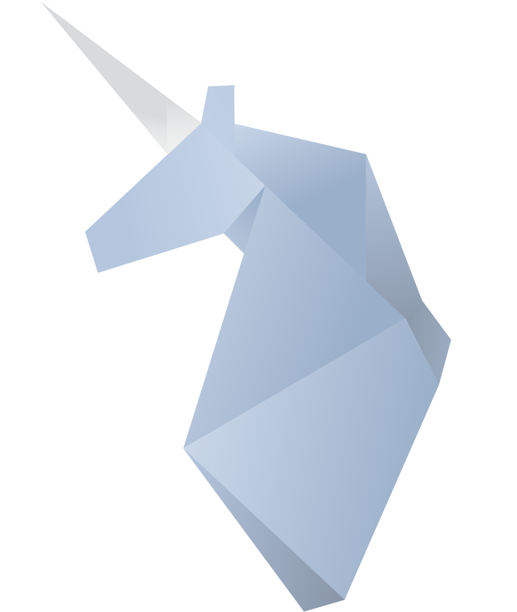

# Unicorn Companies Dashboard

## About This Project

- An interactive dashboard based on plotly Dash, written in Python and including layout customisations with .css bootstrap.
- The dashboard provides insights about unicorn companies and compare between them in different countries and industries.
- The dashboard provides a lot of charts enabling more customizations and comparing between unicorn companies, industries and countries.

## Dataset Information
- Observations: 1038
- Features: 13

### Data Fields
* company - unicorn company name.
* valuation_in_billions - valuation of the unicorn company in billions.
* date_joined	- the date that the company became a unicorn.
* country -	the country that the company belong to.
* city - the city that the company belong to.
* industry - the industry that the company in.
* selected_inverstors -	major investors of that company.
* founded_year - the year that the country founded in.
* total_raised - the total raised of that company.
* investors_count - number of the investors in that company.
* deal_terms - number of deal terms that company held.
* year_joined - the year that the company became a unicorn.
* years_to_unicorn - number of years the company took to become a unicorn.

## Dashboard Screenshot
This is a screenshot that shows charts of our dashboard.

## Built With

